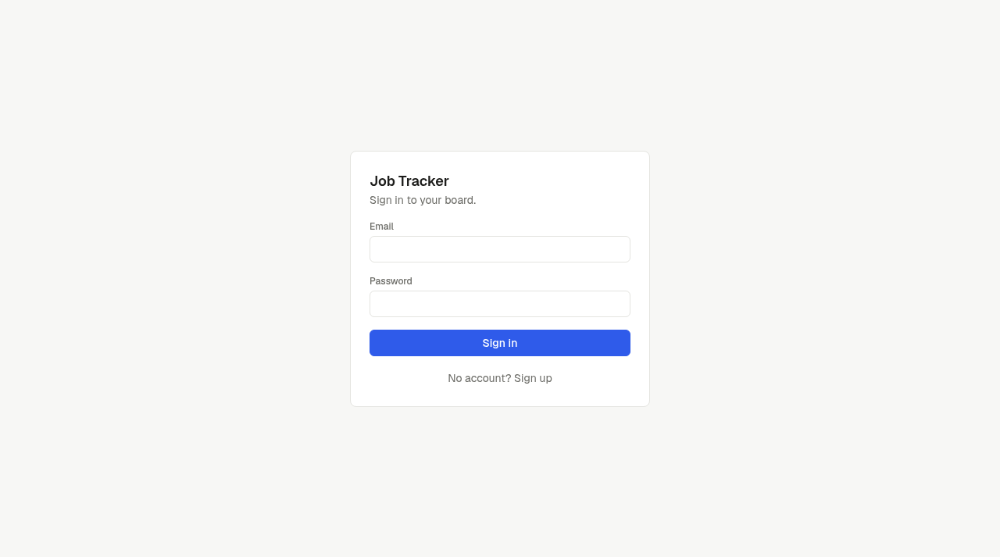

# Job Tracker

**Problem:** job hunting across spreadsheets and inboxes means applications go quiet and nobody follows up. This app makes logging an application a 30-second job, reminds you when one goes stale, and shows which sources actually get replies.

**Live:** https://job-tracker-teal-five.vercel.app



## Features

- **Kanban board** — Saved → Applied → Interviewing → Offer → Rejected → Ghosted, with drag-and-drop status changes.
- **Quick add** — only company and role are required; URL, source and status are optional.
- **Application records** — job URL, source, resume version, notes, and a timeline of status changes, follow-ups, interviews and notes.
- **Follow-up reminders** — anything in Applied with no activity for N days (default 12, configurable in Settings) is flagged at the top of the board. One click logs the follow-up and resets the clock.
- **Contacts** — lightweight, optionally linked to an application.
- **Analytics** — response rate overall, by source and by company; median days to reply; funnel (applied → interview → offer); applications per week.
- **Auth** — Supabase email/password. Single user in practice, but every table is multi-tenant with row level security.

## Stack

Next.js 16 (App Router, Server Actions) · Supabase (Postgres + Auth) · Tailwind CSS 4 · Recharts · dnd-kit · Vercel.

## How it works

Status changes are written to the `events` table by a Postgres trigger, not by the client. That makes the timeline complete by construction, and analytics become plain queries over it: "days to reply" is the gap between `applied_date` and the first `interviewing`/`offer`/`rejected` event. The analytics math lives in `src/lib/analytics.ts` and is unit tested.

## Tradeoffs

- I used Supabase instead of a custom API + ORM because auth, Postgres and row level security come in one box, and this is a ship-it-fast project.
- Analytics are computed in TypeScript over the user's rows instead of SQL views. At personal scale (hundreds of rows) this is instant and much easier to test; it would move into SQL if it ever needed to scale.
- Follow-up reminders show on the board instead of via email. Email would need a scheduled job and a mail provider; that is a v2 idea along with resume parsing, inbox integration and a browser extension.

## Run it locally

1. Create a Supabase project.
2. In the Supabase SQL editor, run `supabase/migrations/0001_init.sql`.
3. Copy `.env.example` to `.env.local` and fill in the project URL and publishable key (Project Settings → API Keys).
4. In Supabase Auth → URL Configuration, add `http://localhost:3000/auth/confirm` and `https://<your-domain>/auth/confirm` to the redirect URLs. For single-user use you can instead turn off "Confirm email".
5. Install and run:

```bash
npm install
npm run dev
npm test
```

## Deploy

Import the repo into Vercel and set `NEXT_PUBLIC_SUPABASE_URL` and `NEXT_PUBLIC_SUPABASE_PUBLISHABLE_KEY` as environment variables.

